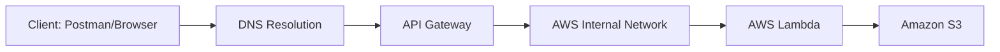

# Serverless Request Flow & Architecture

This document provides a detailed breakdown of the internal request flow and the architectural components of the Photo Manager Lambda system.

## High-Level Architecture

The system follows a standard serverless pattern for handling file uploads:

### 1. Request Lifecycle

1.  **Client Entry**: A client (like Postman or a frontend app) initiates an HTTP POST request to the API endpoint.
2.  **DNS Resolution**: The domain name is resolved to an AWS IP address. Note that DNS only handles naming, not the actual routing of the request payload.
3.  **API Gateway (HTTP API)**: As the public entry point, it handles:
    *   **Routing**: Directing `/upload` requests to the correct Lambda.
    *   **Security**: Authentication and authorization checks.
    *   **Throttling**: Protecting the backend from traffic spikes.
4.  **AWS Internal Network**: Once validated, the request moves into the private, high-speed AWS backbone.
5.  **AWS Lambda**: The compute layer. It scales automatically and executes the "fat JAR" containing the Java logic.
6.  **Amazon S3**: The final destination where image objects are stored durably.

---

## Serverless Execution Concepts

### Cold Start vs. Warm Start
*   **Cold Start**: Occurs when AWS needs to spin up a new execution environment. This involves downloading your code and starting the JVM, which adds latency.
*   **Warm Start**: Occurs when AWS reuses an existing environment from a previous request, leading to much faster response times.

### Scaling Mechanism
AWS Lambda scales by creating **multiple execution environments** in parallel. Unlike traditional servers, there is no load balancer to manage manually; AWS handles all concurrency based on incoming request volume.

---

## Environment Stages

The project is designed to be deployed across three distinct stages to ensure stability:

| Stage | Purpose | Config Stability |
| :--- | :--- | :--- |
| **dev** | Active development and debugging. | High churn. |
| **test** | QA and validation before release. | Stable. |
| **prod** | Live production environment. | Highly stable & optimized. |

Each stage typically uses separate S3 buckets (or prefixes) and independent API Gateway endpoints to prevent cross-environment interference.
